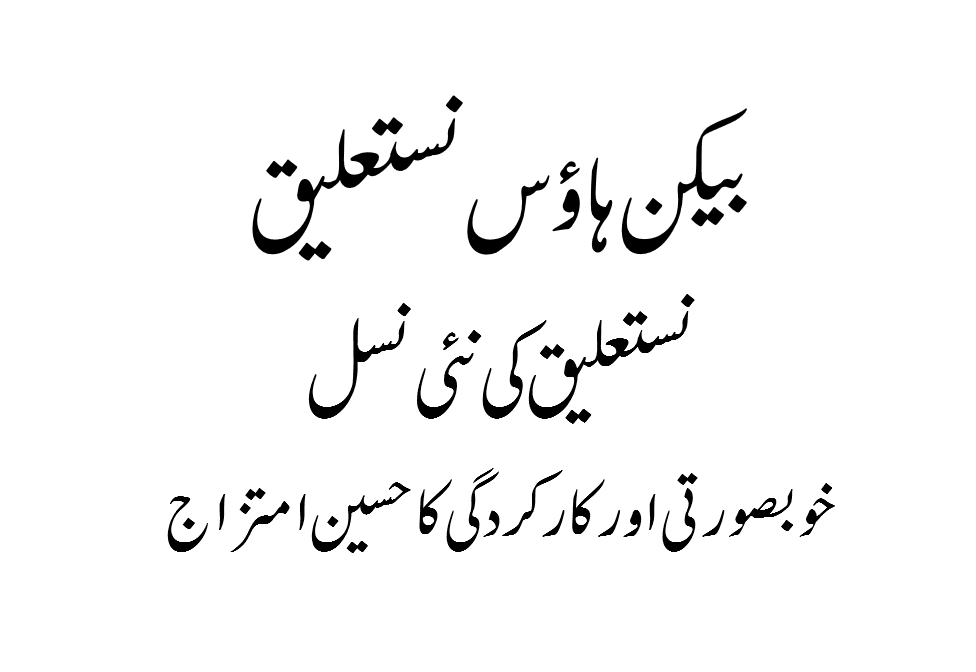
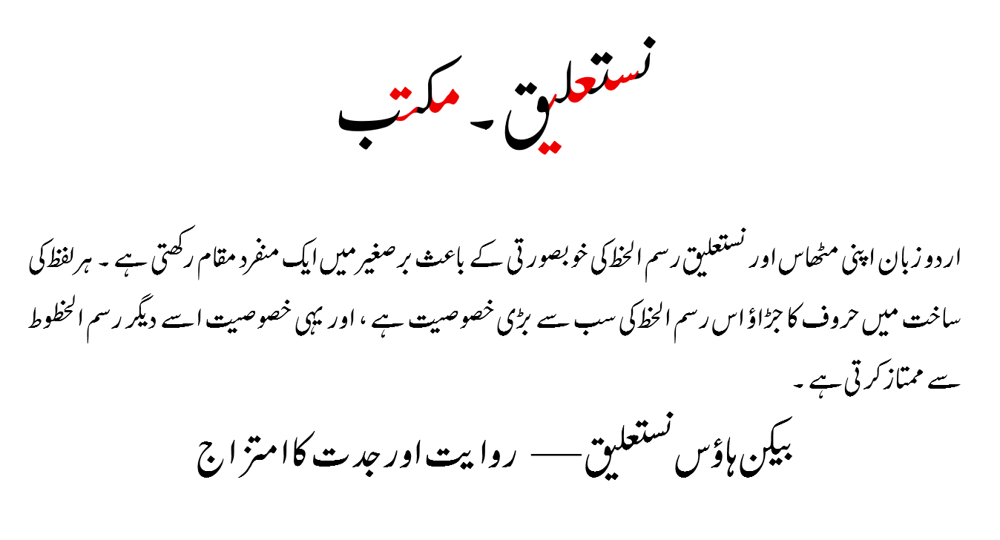

# Beaconhouse Nastaliq

[](https://scripts.sil.org/OFL)

**Beaconhouse Nastaliq** is the first open-source Urdu Nastaliq typeface, designed and engineered entirely by developers in Pakistan. It was commissioned by **Beaconhouse Group** and designed and engineered by **Muhammad Zeeshan Nasar**, built to bring the visual character of **Noori Nastaliq** to a modern, character-based (non-ligature-heavy) architecture suited for the web, publishing, and education.



## About the Project

Traditional Nastaliq fonts like Noori Nastaliq rely on thousands of pre-composed ligatures to render the script's complex joining behavior, which makes them heavy, slow to load, and difficult to maintain. Beaconhouse Nastaliq takes a different approach: it is a **character-based font**, built with roughly **600 glyphs total (including Latin/English glyphs)**, while still aiming for a look and feel close to Noori Nastaliq.

This dramatic reduction in glyph count was made possible by a custom **joining-glyph technique**: instead of drawing a unique ligature for every possible letter combination, the font uses a set of extension/joining glyphs that combine with base glyphs through GSUB rules to dynamically produce the hundreds of contextual forms Nastaliq requires — without pre-building each one individually.

## Key Features

- **Character-based architecture** — ~600 glyphs total instead of the thousands of ligatures typical Nastaliq fonts require, achieved through a custom joining-glyph (extension glyph) system built with OpenType GSUB rules.
- **Noori Nastaliq–inspired design** — visually closer to the classic Noori Nastaliq look, re-engineered for efficient digital rendering.
- **Automatic dot-collision avoidance** — one of the hardest problems in Nastaliq typesetting is overlapping dots between adjacent letters. Beaconhouse Nastaliq uses custom **GPOS and GSUB rules** to detect and resolve dot collisions automatically wherever they occur.
- **Full diacritic (اعراب) support** — proper positioning and rendering of Urdu diacritical marks.
- **Built-in letter-joining education feature** — the glyphs are specially cut and shaped so that each letter's contribution to a joined word can be visually isolated. For example, in the word "نستعلیق," coloring each letter individually clearly shows where each character starts and ends within the joined form. This makes the font a practical tool for children learning how Urdu letters join together, simply by coloring or highlighting individual characters.



## Ownership and Credits

Beaconhouse Nastaliq was commissioned by, and is solely owned by, **Beaconhouse Group**.

- **Beaconhouse Group** — Commissioning Body & Copyright Holder
  - Website: <https://www.beaconhouse.net/>
  - *Beaconhouse is one of the world's largest private school networks, committed to educational excellence and cultural preservation.*

- **Muhammad Zeeshan Nasar** — Designer & Engineer
  - *Designed and engineered the font's character-based architecture, joining-glyph system, and dot-collision resolution rules.*

See [`AUTHORS.txt`](AUTHORS.txt) and [`CONTRIBUTORS.txt`](CONTRIBUTORS.txt) for the full copyright and contributor record.

## License

This Font Software is licensed under the SIL Open Font License, Version 1.1.
This license is copied in [`OFL.txt`](OFL.txt), and is also available with a FAQ at: <https://scripts.sil.org/OFL>

## Repository Structure

- `sources/` — Source files (UFO / Glyphs) for the font, including the joining-glyph components and GSUB/GPOS rule definitions.
- `fonts/` — Final binary font files (TTF/OTF).
- `documentation/` — Images, samples, and promotional materials.

## Changelog

**Beaconhouse Nastaliq Font**

**04 August 2026 — Version 1.00**
- First official release.
- 1 stylistic set added.

## Building from Source

To build the font files from source, use the standard font engineering tools:

1. **Install dependencies:**

   ```bash
   pip install fontmake gftools
   ```

2. **Build the font:**

   ```bash
   gftools builder sources/upstream.yaml
   ```


---

**Copyright (c) 2026 Beaconhouse Group.**
